# Defects

## BUG-01: Past event are displayed on the betting page
* Severity: High.
* Reproduction Steps:
  1. Go to the betting page: https://qae-assignment-tau.vercel.app/?user-id={yourUserId};
  2. View Match List;
* Expected Result: Only upcoming events are displayed on the betting page.
* Actual Result: Betting page displays past events.
* Business Impact: The business logic requirements specify that only upcoming events should be displayed.
While not critically problematic on its own, this can lead to more severe issues if user is allowed 
to place bets on the past event (see BUG-02).
* Evidence:

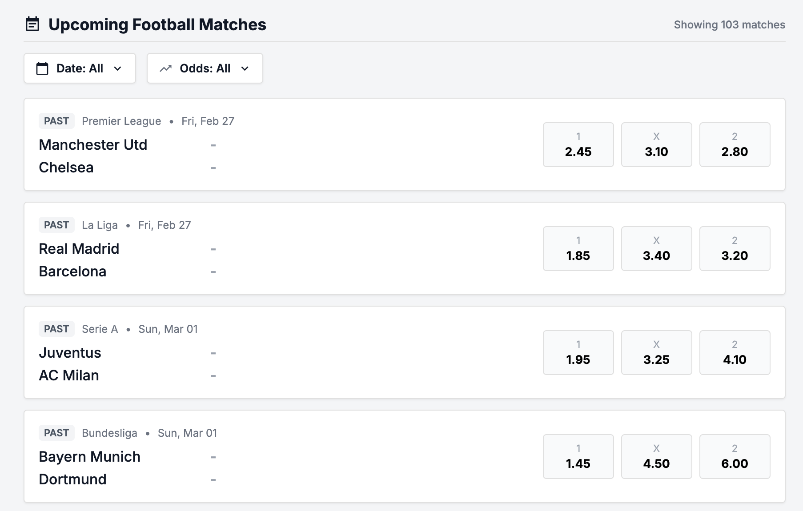

## BUG-02: User can place a bet on a past event
* Severity: Critical.
* Reproduction Steps:
  1. Go to the betting page: https://qae-assignment-tau.vercel.app/?user-id={yourUserId};
  2. Try to select any past event and place a bet on any of its odds.
* Expected Result: User is unable to place a bet on a past event.
* Actual Result: User can place bets on past events.
* Business Impact: The ability of users to bet on a past event presents a financial risk of paying out 
odds that are bigger than 1 on an event that has already been resolved.
* Evidence: 
 
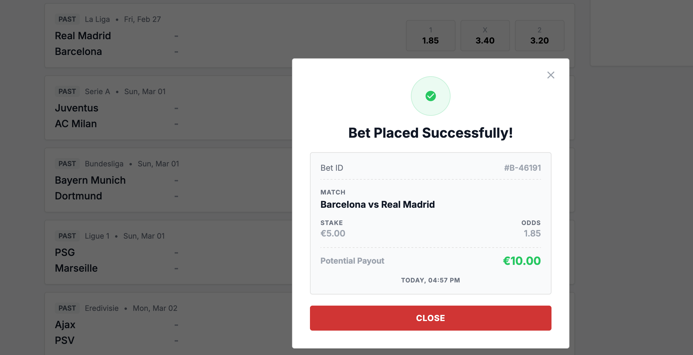

## BUG-03: Bet receipt displays incorrect potential payout
* Severity: Critical.
* Reproduction Steps:
  1. Go to the betting page: https://qae-assignment-tau.vercel.app/?user-id={yourUserId};
  2. Select the closest upcoming match, odds: `1`;
  3. Input the 10 EUR stake into the bet slip;
  4. Confirm bet placement by clicking 'Place bet' button;
  5. Review the bet receipt.
* Expected Result: Receipt displays correct bet information, including unique bet ID, event, stake, 
  potential payout, bet timestamp.
* Actual Result: Receipt displays incorrect potential bet payout.
* Business Impact: The bet receipt should clearly display the correct information as it represents 
a business transaction.
* Evidence:
 
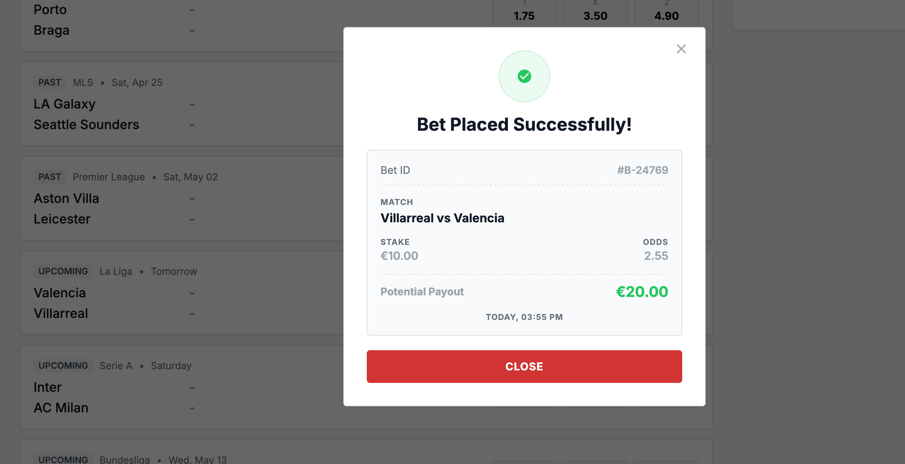

## BUG-04: User balance is not updated upon bet placement
* Severity: Critical.
* Reproduction Steps:
  1. Go to the betting page: https://qae-assignment-tau.vercel.app/?user-id={yourUserId};
  2. Select any upcoming event and place a bet on any of its odds;
  3. Make sure that the stake is greater than half of the user balance;
  4. Repeat steps 2 and 3 without refreshing the betting page.
* Expected Result: User balance is updated upon bet placement. 
User is not allowed to place a bet that is greater than their current balance.
* Actual Result: User balance is not updated on bet placement. User balance is updated on page refresh,
allowing to place bets that exceed user balance. 
* Business Impact: Inaccurate and poorly kept balance data can lead to potential financial losses, exploits,
support team overhead required to address and fix discrepancies, and customer dissatisfaction.
* Evidence: 
 
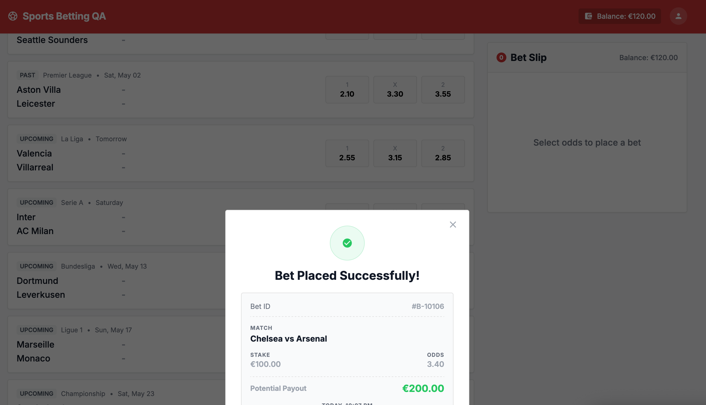
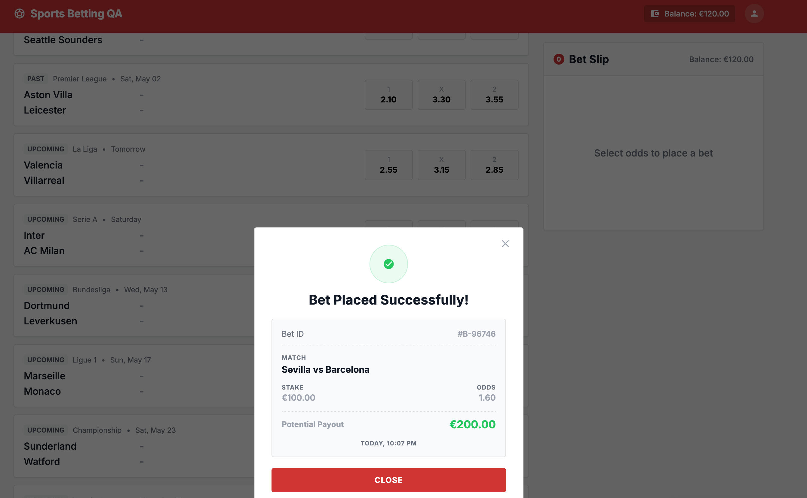
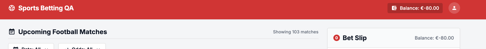

## BUG-05: User can place multiple duplicates of the same bet by spam clicking Place Bet button
* Severity: Critical.
* Reproduction Steps:
  1. Go to the betting page: https://qae-assignment-tau.vercel.app/?user-id={yourUserId};
  2. Select any upcoming event and place a bet on any of its odds;
  3. While the bet is being processed and 'Place bet' button is displayed as inactive, 
  spam click the button to generate large amount of duplicate request for the same bet placement. 
* Expected Result: User is not allowed to place a duplicate of a bet that is already being processed.
* Actual Result: User can place a duplicate of a bet that is already being processed, 
to the point where their balance goes into the negative numbers.
* Business Impact: Betting process should be protected against this type of exploits as they can lead to
potential financial losses, support team overhead required to address and fix discrepancies, 
and customer dissatisfaction.  
* Evidence: 
 
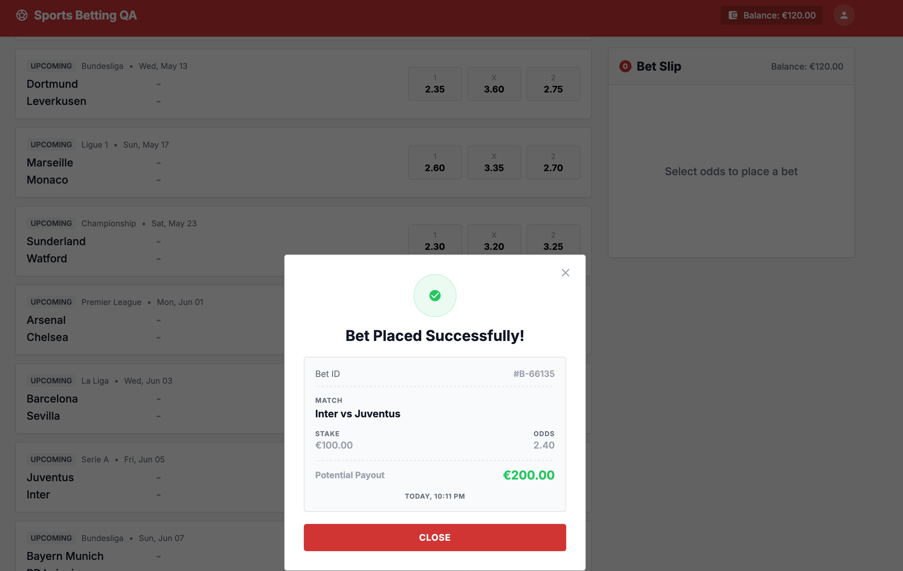

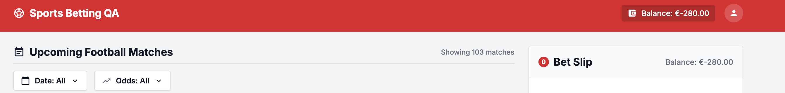

## BUG-06: Place bet endpoint returns incorrect currency in the response
* Severity: Critical.
* Reproduction Steps:
  1. Send a POST request to the following endpoint: https://qae-assignment-tau.vercel.app/api/place-bet, 
specify X-User-Id auth header, with body that represents any upcoming event odds;
  2. Input the 10 EUR stake into the bet payload;
  3. Review the request response
* Expected Result: Request response's `currency` value is `EUR`.
* Actual Result: Request response's `currency` value is `USD`.
* Business Impact: The bet request response should clearly display the correct information as it represents 
a business transaction.
* Evidence: 

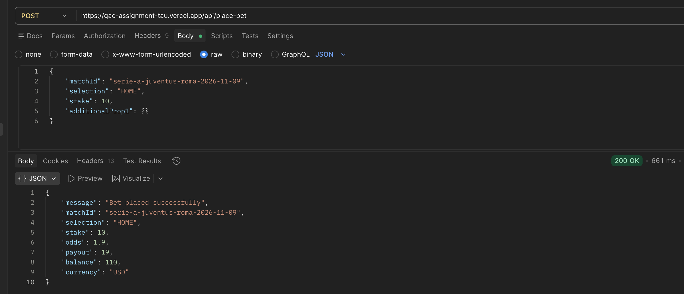

## BUG-07: Balance reset endpoint returns incorrect balance in the response
* Severity: Low.
* Reproduction Steps:
  1. Send a POST request to the following endpoint: https://qae-assignment-tau.vercel.app/api/reset-balance, 
specify X-User-Id auth header;
  2. Note the `balance` value in the request response;
  3. Send a GET request to the following endpoint: https://qae-assignment-tau.vercel.app/api/balance, 
specify X-User-Id auth header;
  4. Compare the `balance` value in the GET request response to the `balance` value from Step 3.
* Expected Result: Balance reset endpoint returns the same `balance` value as the balance endpoint.
* Actual Result: Balance reset endpoint returns a different `balance` value from the balance endpoint.
* Business Impact: Assuming this endpoint exists only as a test instrument to allow for a reset to a preconfigured 
balance, this is should not affect production environment.  
* Evidence: 
 
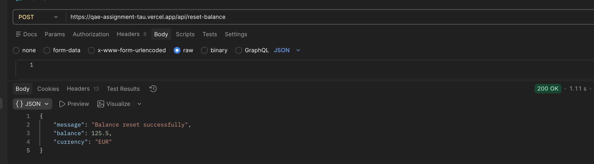
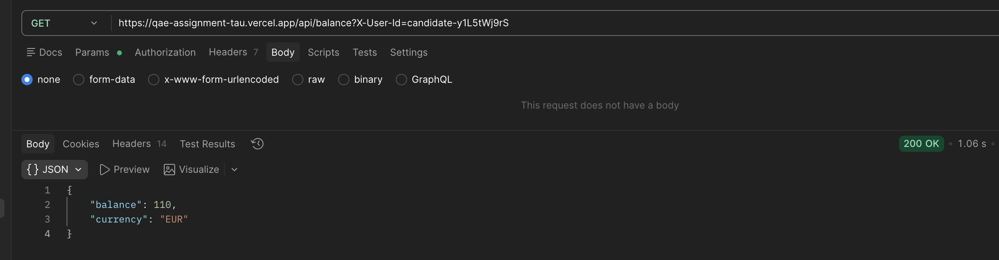
